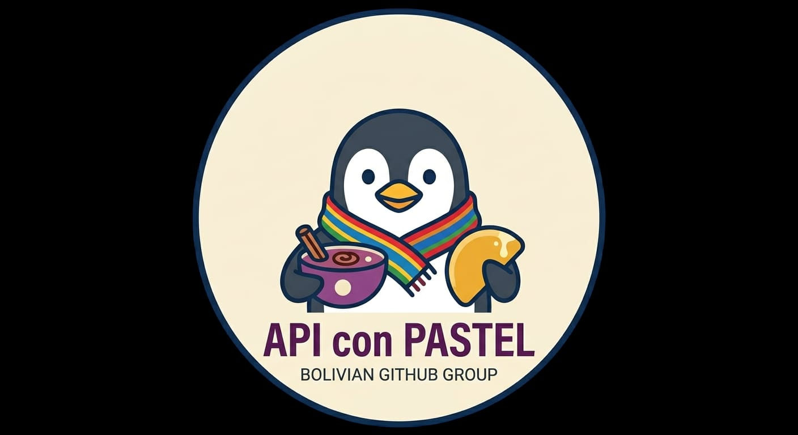

<div align="center">
  

  # Mini Chess 6×6 — Ajedrez en Java

  **Grupo 9 · API con Pastel**

  Proyecto grupal para el curso de Git — SCESI · UMSS · I-2026
</div>

---

## Equipo

| Nombre | Cel. | Correo | Rol |
|---|---|---|---|
| **Bryan Vasquez Maldonado** | 69512710 | bryan.vasquez.456@gmail.com | Lógica del tablero, motor de juego, interfaz gráfica |
| **Roger Eric Saldivar Rojas** | 64883811 | rogerictober@gmail.com | Lógica del tablero, motor de juego, interfaz gráfica |
| André Helian Aldunate Guzmán | 63596760 | 201900828@est.umss.edu | Creó el repositorio |
| Vania Anabel Garcia Fernandez | 74326447 | 202501492@est.umss.edu | Sin participación |

> **Nota sobre la participación:** El desarrollo real del proyecto estuvo a cargo exclusivamente de **Bryan Vasquez** y **Roger Saldivar**. André creó el repositorio y no volvió a participar. Vania tampoco tuvo contribuciones. Adicionalmente, las ramas `main` y `develop` fueron bloqueadas por el administrador del repositorio, impidiendo que se pudieran aprobar Pull Requests. Por esta razón, el equipo activo creó la rama `develop2` como rama de integración y trabajo colaborativo.

---

## Descripción del Proyecto

**Mini Chess 6×6** es un juego de ajedrez simplificado implementado completamente en Java, con interfaz gráfica desarrollada con la librería Swing. El tablero es de 6×6 casillas en lugar del estándar de 8×8, lo que genera partidas más rápidas e intensas sin sacrificar la profundidad estratégica del ajedrez clásico.

### Características

- Tablero 6×6 con diseño visual inspirado en madera oscura y crema
- 4 tipos de piezas por bando: Rey, Reina, Torre y Peón
- Detección y aviso de **Jaque** al rey
- Detección de **Jaque Mate** y fin de partida
- Detección de **Tablas por ahogado** (Stalemate)
- Resaltado visual de la pieza seleccionada
- Puntos de sugerencia para los movimientos legales disponibles
- Resaltado del último movimiento realizado
- Glow rojo sobre el Rey cuando está en jaque
- Historial de movimientos en tiempo real en la barra lateral
- Promoción automática del Peón a Reina al llegar al extremo
- Coordenadas (a–f, 1–6) dibujadas en el tablero
- Botones de "Nueva partida" y "Reglas" en la interfaz
- Compatible con Windows y Linux

### Arquitectura del Proyecto

El proyecto está compuesto por 8 clases Java, cada una con una responsabilidad clara:

```
src/
├── ChessFrame.java    — Ventana principal de la aplicación (JFrame)
├── BoardPanel.java    — Panel gráfico del tablero; maneja clics y renderizado
├── GameState.java     — Estado de la partida: turno, estado y lógica de flujo
├── Board.java         — Motor del juego: tablero, movimientos y reglas
├── Piece.java         — Representación de una pieza (tipo + color)
├── PieceType.java     — Enum: KING, QUEEN, ROOK, PAWN
├── PieceColor.java    — Enum: WHITE, BLACK
└── Position.java      — Coordenada (fila, columna) en el tablero
```

---

## Requisitos Previos

Antes de ejecutar el proyecto, asegúrate de tener instalado:

- **Java Development Kit (JDK) 17 o superior**
- No se necesitan dependencias externas ni frameworks adicionales

Para verificar si tienes Java instalado, abre una terminal y ejecuta:

```bash
java -version
```

Deberías ver algo como:
```
openjdk version "17.x.x" ...
```

Si no tienes Java, descárgalo desde: https://adoptium.net

---

## Cómo Ejecutar el Proyecto

### Paso 1: Clonar el Repositorio

```bash
git clone https://github.com/Helian244/Trabajo-Grupal-Git.git
cd Trabajo-Grupal-Git
```

### Paso 2: Cambiar a la rama de trabajo

> La rama principal de desarrollo es `develop2`, ya que `main` y `develop` estaban protegidas.

```bash
git checkout develop2
```

### Paso 3: Compilar los archivos fuente

Navega a la carpeta `src` y compila todos los archivos Java:

**En Windows (PowerShell o CMD):**
```powershell
cd src
javac *.java
```

**En Linux / macOS (Terminal):**
```bash
cd src
javac *.java
```

Si la compilación fue exitosa, no se mostrará ningún mensaje de error y verás una serie de archivos `.class` generados en la misma carpeta.

### Paso 4: Ejecutar la aplicación

Desde la carpeta `src`, ejecuta:

**En Windows:**
```powershell
java ChessFrame
```

**En Linux / macOS:**
```bash
java ChessFrame
```

La ventana del juego se abrirá automáticamente.

---

## Cómo Jugar

1. **Seleccionar una pieza:** Haz clic sobre cualquiera de tus piezas (turno de las Blancas primero). La casilla se resaltará en verde y aparecerán puntos que indican los movimientos disponibles.
2. **Mover la pieza:** Haz clic sobre uno de los puntos verdes para mover. Si el destino tiene una pieza enemiga, se resalta con un recuadro para indicar una captura.
3. **Turno alternado:** Tras cada movimiento válido, el turno pasa al otro jugador.
4. **Jaque:** El Rey amenazado se iluminará con un resplandor rojo. El jugador debe escapar del jaque en su siguiente movimiento.
5. **Fin de la partida:** Al detectar Jaque Mate o Tablas, aparece un diálogo con el resultado y la opción de iniciar una nueva partida.

### Reglas Especiales

| Pieza | Movimiento |
|---|---|
| Rey (♔/♚) | 1 casilla en cualquier dirección |
| Reina (♕/♛) | N casillas en línea recta o diagonal |
| Torre (♖/♜) | N casillas en línea recta (horizontal o vertical) |
| Peón (♙/♟) | Avanza 1 casilla (2 en el primer movimiento); captura en diagonal; se promueve a Reina al llegar al extremo opuesto |

> No se incluye el enroque ni la captura al paso en esta versión simplificada.

---

## Workflow de Git utilizado

Se siguió el modelo **Git Flow** con las siguientes ramas:

| Rama | Propósito |
|---|---|
| `main` | Rama principal protegida (no accesible para el equipo) |
| `develop` | Rama de integración protegida (no accesible para el equipo) |
| `develop2` | Rama de integración alternativa, usada por el equipo activo |
| `feature/board-logic` | Implementación de la lógica del tablero y el motor de juego |
| `feature/graphical-interface` | Implementación de la interfaz gráfica con Swing |

### Convención de Commits

Todos los commits siguen el estándar de **Conventional Commits**:

```
<tipo>: <descripción breve en inglés>

Tipos usados:
  feat     → nueva funcionalidad
  fix      → corrección de un error
  refactor → cambio interno sin alterar comportamiento
  docs     → cambios en documentación
```

**Ejemplos de commits del proyecto:**
```
feat: implement board setup and piece initialization
feat: implement validation basic logic movements
feat: get valid moves for rook and king
feat: implement logic validation for queen and pawn moves
feat: add logic to simulate check to the king
feat: implement main game window and UI layout
feat: implement advanced board rendering and check indicators
fix: resolve compilation errors and rename ChessFrame class
```

---

## Estructura de Archivos del Repositorio

```
Trabajo-Grupal-Git/
├── README.md
├── .gitignore
├── logo/
│   └── logo.jpeg
└── src/
    ├── ChessFrame.java
    ├── BoardPanel.java
    ├── GameState.java
    ├── Board.java
    ├── Piece.java
    ├── PieceType.java
    ├── PieceColor.java
    └── Position.java
```

---

<div align="center">

**SCESI — Sociedad Científica de Estudiantes de Sistemas e Informática**

Universidad Mayor de San Simón · Cochabamba, Bolivia · I-2026

</div>
